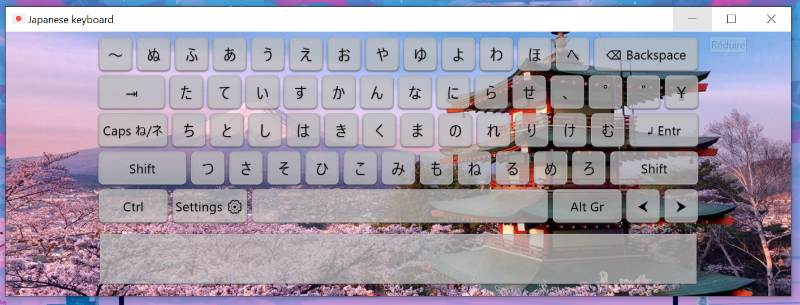

# Japanese Keyboard
> Made with ❤ by Leo.t88

- This Japanese keyboard allows you to transform your keyboard into a Japanese keyboard (With keyboard keys or touch keys)

- This keyboard allows you to write with Hiragana and Katagana easily and quickly since the keyboard and also display visually practical if you are not the habit of using it daily.

**Information :**
For the moment there are not support for QWERTY Keyboard (Unless you use the touch buttons in the app) and you can't change the wallpaper of the keyboard (in app)
If you would change the wallpaper replace in the folder ``assets`` (in the same folder that keyboard app), with the same name ``background`` and the same extension file ``.jpg``

*View and Download the [latest version here](https://github.com/leo-t-88/japanese-keyboard/releases/latest)*
